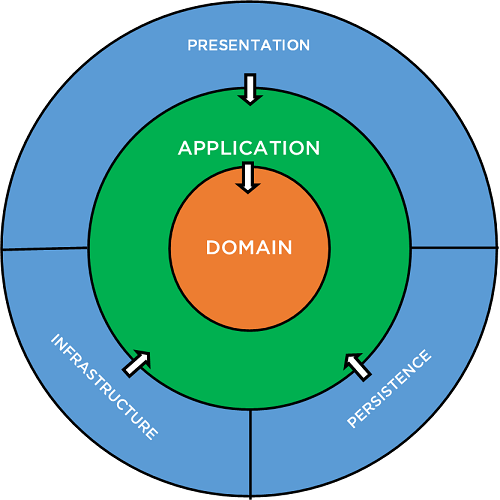

# WOMS

Wholesale Order Management System

The Wholesale Order Management System is a web-based application built on the CQRS (Command Query Responsibility Segregation) architecture using .NET 7. The system is designed to manage orders and inventory for a wholesale business. The backend uses PostgreSQL as the primary database and utilizes EF Core and MediatR libraries for handling data access and business logic.

